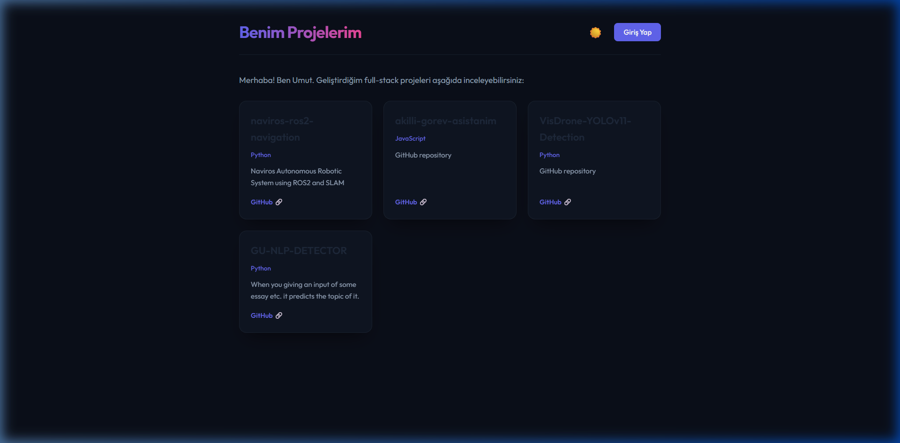

# Portfolio Manager

A full-stack personal portfolio application built with React, Node.js, Express, and MongoDB. The frontend consumes a self-hosted REST API that manages project data stored in MongoDB Atlas. Authentication is JWT-based and all routes that mutate data are role-protected.



---

## What this does

The site acts as a dynamic resume page. Instead of maintaining a static HTML page, projects live in a database and the frontend fetches and renders them at runtime. Administrators can log into a panel and manage projects directly from the browser — including importing repositories straight from GitHub via the GitHub REST API.

**Why not just use a static site?** I wanted practice with building real authentication flows, protecting API routes properly, and handling data dynamically. Static sites also make it harder to update content without touching code every time.

---

## Features

- Browse projects without logging in — the public-facing page has no auth requirement
- Admin panel for creating, editing, and deleting projects
- GitHub repository importer: fetches public repos from a GitHub username and bulk-imports selected ones into the database
- Light/dark mode toggle (preference is persisted via localStorage)
- JWT-based authentication with role checking on both frontend and backend

---

## Security

**Authentication & Authorization (RBAC)**

Two middleware functions run in sequence on any request that modifies data:

1. `authMiddleware` — verifies the JWT from the `Authorization` header. If the token is missing or invalid, the request fails here with `401 Unauthorized`.
2. `adminMiddleware` — decodes the verified payload and checks the `rol` claim. If it's not `"admin"`, the request is rejected with `403 Forbidden` before reaching any routing logic.

GET requests are public. POST, PUT, and DELETE require both middlewares.

**NoSQL Injection**

MongoDB queries accept JSON objects, which means an attacker could send `{ "$ne": "" }` as a password field and potentially bypass string comparisons. `express-mongo-sanitize` strips any keys starting with `$` or containing `.` from `req.body`, `req.query`, and `req.params` before they reach the database layer.

*Note: the library has a compatibility issue with Express 5 where it tries to overwrite `req.query`, which is now a read-only getter. The fix is to redefine the property as writable before the sanitizer runs — see `server.js` for the implementation.*

**Rate Limiting & Header Hardening**

- Global limiter: 100 requests per 15-minute window (`express-rate-limit`)
- Login endpoint limiter: 5 attempts per 3 minutes to slow down brute-force attempts
- `helmet` sets security-related HTTP response headers (X-Frame-Options, X-Content-Type-Options, etc.)

**Controlled Signups**

The registration endpoint requires an `adminSecret` field matched against an environment variable. Requests without the correct secret get a `403`. Users who register are provisioned directly as `admin` — there's no concept of a regular user account because there's no reason for one to exist in a personal portfolio.

---

## Stack

| Layer | Technology |
|---|---|
| Frontend | React 19, Vite, Vanilla CSS |
| Backend | Node.js, Express 5 |
| Database | MongoDB, Mongoose 9 |
| Auth | JWT, bcryptjs |
| Security | helmet, express-rate-limit, express-mongo-sanitize, express-validator |

---

## Running locally

### Prerequisites

- Node.js v18+
- A MongoDB connection string (local instance or Atlas)

### Backend

```bash
cd backend
npm install
```

Create a `.env` file:

```env
PORT=5000
MONGODB_URI=your_connection_string
JWT_SECRET=your_jwt_secret
ADMIN_REGISTRATION_SECRET=your_signup_secret
```

```bash
npm run dev
```

### Frontend

```bash
cd frontend
npm install
npm run dev
```

Open `http://localhost:5173`.

---

## Project structure

```
portfolio-app/
├── backend/
│   ├── middleware/
│   │   ├── auth.js          # JWT verification
│   │   └── admin.js         # Role check
│   ├── models/
│   │   ├── User.js
│   │   └── Project.js
│   ├── routes/
│   │   ├── auth.js          # /api/auth
│   │   ├── project.js       # /api/projects
│   │   └── user.js          # /api/user
│   └── server.js
└── frontend/
    └── src/
        ├── components/
        │   ├── AdminPanel.jsx
        │   ├── Login.jsx
        │   └── Register.jsx
        └── App.jsx
```
